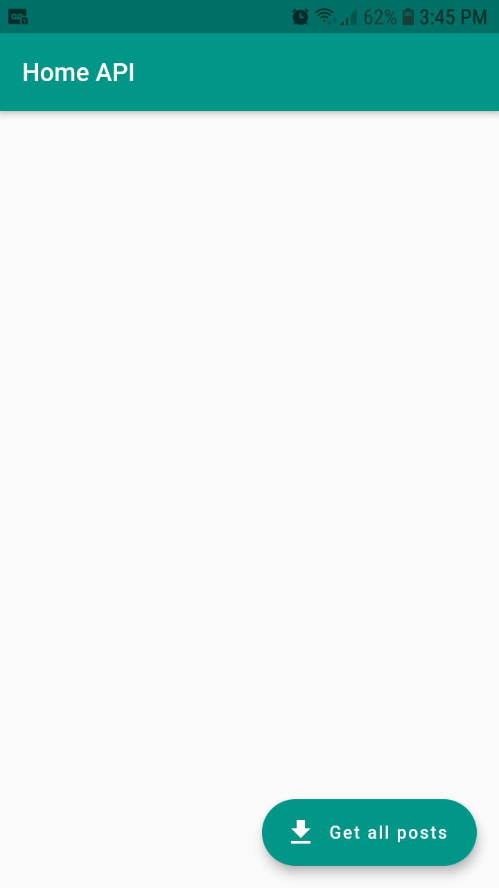
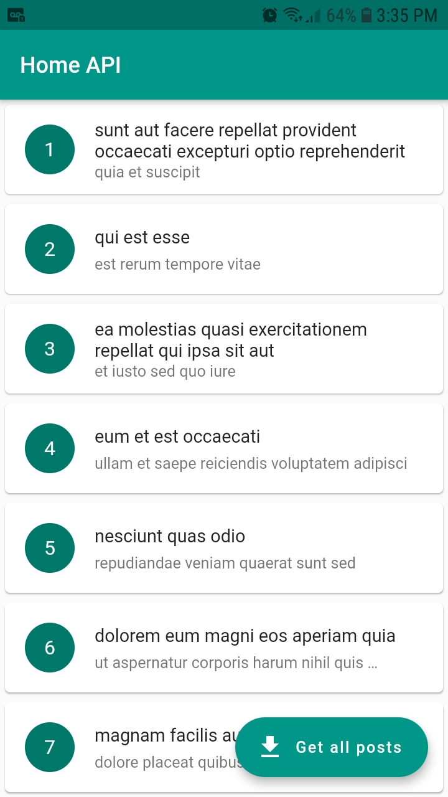

# #LevelUP4

Pequeno desafio proposto na aula de API's, tendo como objetivo fazer a requisição de posts em uma api fake a partir do método GET.

## Features

- Lista de cards com as propriedades: id, title e subtitle
- FAB - FloatingActionButton com método GET e atualização para renderização na tela

## Resultado

 
 

